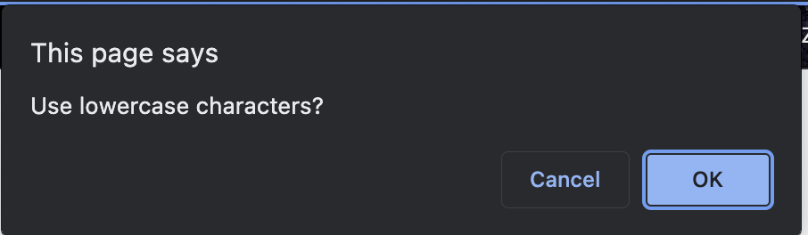
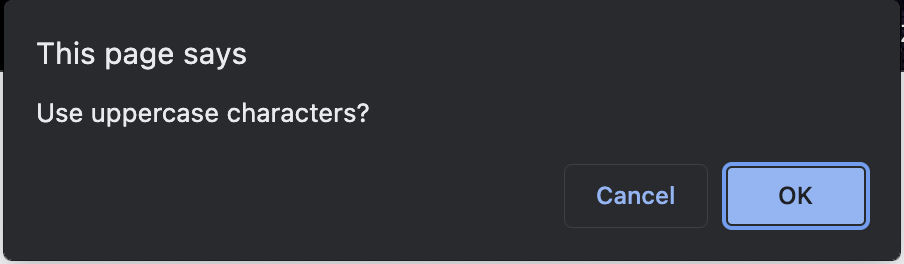
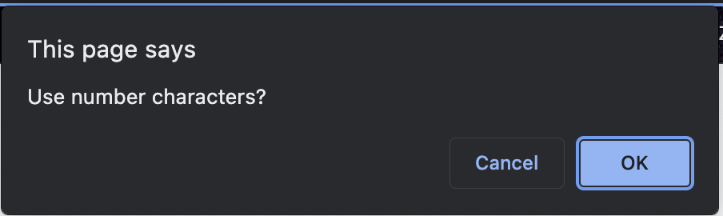

# pass-gen
javascript password generator

## Technology Used 

| Technology Used         | Resource URL           | 
| ------------- |:-------------:| 
| HTML    | [W3Schools - HTML](https://www.w3schools.com/html/html_intro.asp) | 
| CSS     | [W3Schools - CSS](https://www.w3schools.com/css/css_intro.asp)      |
| JAVASCRIPT     | [W3Schools - JS](https://www.w3schools.com/js/js_intro.asp)      |   
| Git       | [About GitHub](https://git-scm.com/about)     |    

## Description 

[View the webpage](https://chlarson74.github.io/###)

PROJECT DESCRIPTION -- I was provided with the HTML document and existing CSS styles. I was tasked to create a Javasctript code that would generate a password for the user. The password has to be a characters length between 8 and 128 characters long. The user could choose from a list of available character setss (i.e. uppercase, lowercase, numbers etc.). The user would be presented with their new password once they have selected the parameters. 

Work completed:
- Create a list of character arrays
- Create a prompting function with a series of if/else statements.
- Confirm that the user has chosen a character length of the required value
- Confirm that the user has chosen at least one character set
- Integrate the UCB premade code with the code I developed through instruction, research and study groups to make a functioning password generator.

## Usage 

Webpage deployed online is accessible through a web browser like Google Chrome.

## Learning Points 

- Create variables and apply them to javascript functions.
- Create an array for a variable
- Prompt the user with javascript
- Implement an if/else statement
- Concat arrays
- Alert the user if something isn't correct
- Math.floor will round down and Math.ceil will round up
- Research, reading, instruction and study groups are crucial to success

## Author Info

### Chris Larson

* [LinkedIn](https://www.linkedin.com/in/christian-larson-6208a43b/)
* [Github](https://github.com/chlarson74)

## License
MIT License

Copyright (c) [2023] [Chris Larson]

Permission is hereby granted, free of charge, to any person obtaining a copy
of this software and associated documentation files (the "Software"), to deal
in the Software without restriction, including without limitation the rights
to use, copy, modify, merge, publish, distribute, sublicense, and/or sell
copies of the Software, and to permit persons to whom the Software is
furnished to do so, subject to the following conditions:

The above copyright notice and this permission notice shall be included in all
copies or substantial portions of the Software.

THE SOFTWARE IS PROVIDED "AS IS", WITHOUT WARRANTY OF ANY KIND, EXPRESS OR
IMPLIED, INCLUDING BUT NOT LIMITED TO THE WARRANTIES OF MERCHANTABILITY,
FITNESS FOR A PARTICULAR PURPOSE AND NONINFRINGEMENT. IN NO EVENT SHALL THE
AUTHORS OR COPYRIGHT HOLDERS BE LIABLE FOR ANY CLAIM, DAMAGES OR OTHER
LIABILITY, WHETHER IN AN ACTION OF CONTRACT, TORT OR OTHERWISE, ARISING FROM,
OUT OF OR IN CONNECTION WITH THE SOFTWARE OR THE USE OR OTHER DEALINGS IN THE
SOFTWARE.

---

© 2023 edX Boot Camps LLC. Confidential and Proprietary. All Rights Reserved.